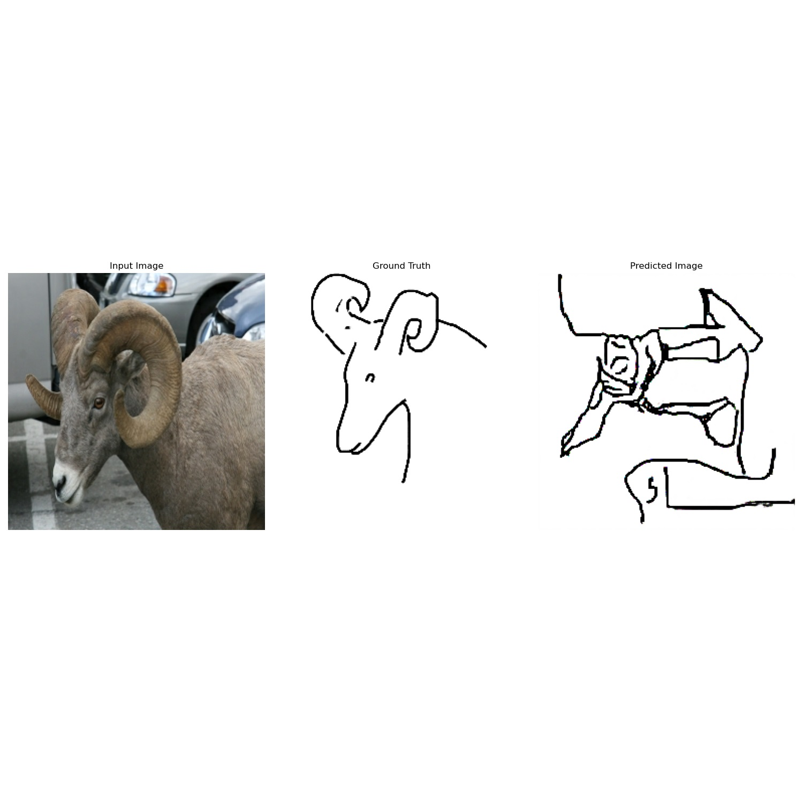

# photo2sketch

This is an implementation of an adversarial networks to translate a photo into a sketch. This project 
uses tensorflow and sketchy dataset available [here](http://sketchy.eye.gatech.edu//).



## Installation
```bash
pip install -r requirements.txt
```

## Usage
this projects presumes that the sketchy dataset is in the data folder.
